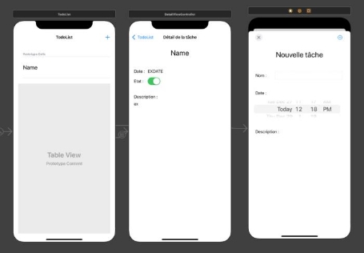
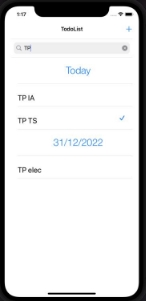

#Compte rendu Todo List 

##Introduction : 

Nous allons à travers ce TP mettre en pratique les notions de Swift vues en cours afin de créer un gestionnaire de tâches à l’aide de XCode et de l’architecture MVC. Nous commencerons par créer le modèle de données puis nous ajouterons des vues pour chaque fonctionnalité. 

###1. Conception du modèle de données 

La première étape est de définir la structure d’une tâche. L’énoncé nous indique qu’une tâche doit être au minimum constituée d’un nom et d’une description. J’ai choisi d’ajouter un état à la tâche car il est essentiel de noter une tâche comme réalisée dans une Todo List. J’ai également ajouté une date au sein de la classe qui représente la date de l’échéance de la tâche afin de pour pouvoir réaliser un tri par date. 

Tous ces attributs réunis construisent la classe Todo définie par le diagramme UML suivant : 

|Todo|
| - |
|+ name : String |
|+ desc : String |
|+ date : Date |
|+ state : Bool |
|+ init() : void |
###2. Création du Storyboard et Programmation de l'application 

J’ai créé trois vues ayant chacune leur objectif :  

- La première est la vue principale sur laquelle on arrive lorsqu’on lance l’application. Elle permet l’affichage de toutes les listes. 
- La deuxième vue apparait lorsqu’on clique sur une tâche et affiche les détails de la tâche : son nom, sa description, sa date et son état. 
- La troisième vue apparait par-dessus la première lorsqu’on veut créer une tâche et permet de renseigner le nom de la tâche, sa description et sa date d’échéance. 

*Figure 2 - Création des vues* 

###3. Ajout de la date de réalisation 

J’ai donc trié les tâches par date à l’aide de la fonction *sortedby()* et mis en place des sections dans le tableview pour afficher les cellules de tâches dans des sections. 

J’ai créé une classe section en suivant le modèle ci-dessous :  

|Section|
| - |
|+ date : Date |
|+ todos : [Todo] |
|+ init() : void |
*Figure 3 - Class Section* 

Chaque Todo était donc mise dans la section correspondante à sa  date d’échéance. 

*Figure 4 - Tri par date* 

###4. Ajout d'un moteur de recherche 

J’ai ajouté un UISearchBar dans le tableview pour implémenter cette fonctionnalité à l’application.  
J’ai ensuite modifié le contenu du tableau de Section *data* lorsque le contenu de la barre de recherche est modifié.  

*Figure 5 - Recherche de tâches* 

##Conclusion 

Ce projet a été une bonne introduction aux bases de la programmation mobile et plus précisément la programmation d’applications en Swift. Il nous a permis de mieux comprendre l’architecture MVC. 
